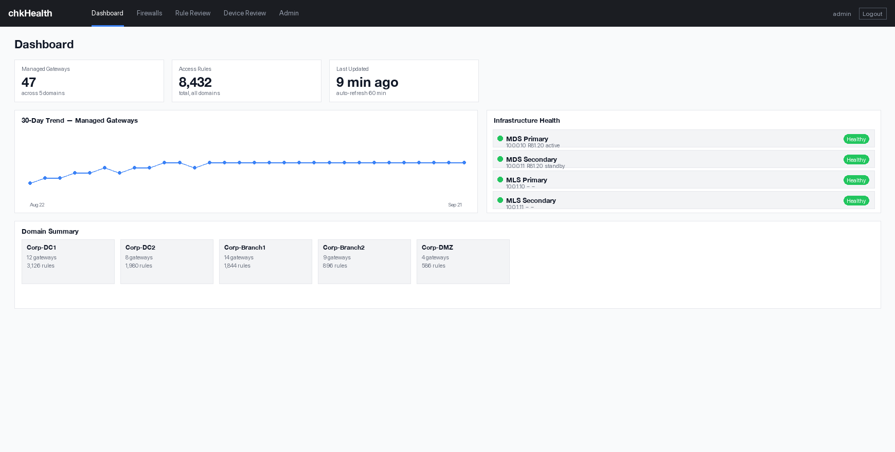
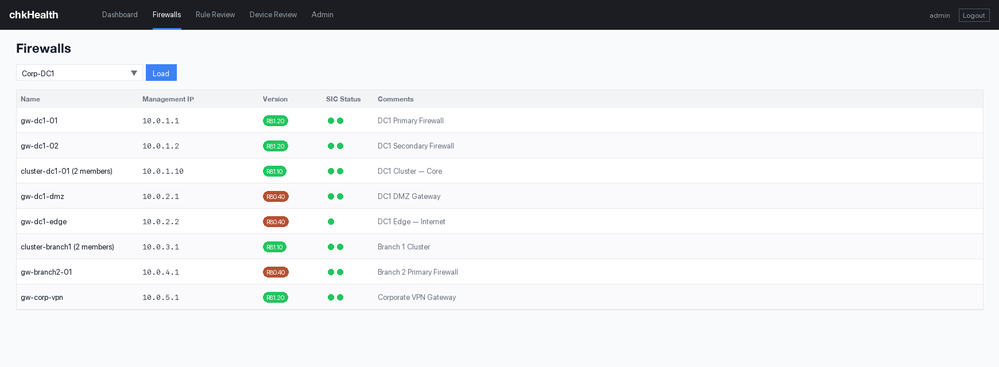
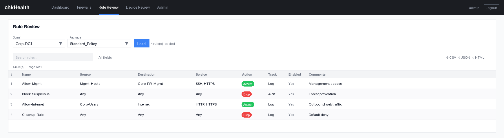
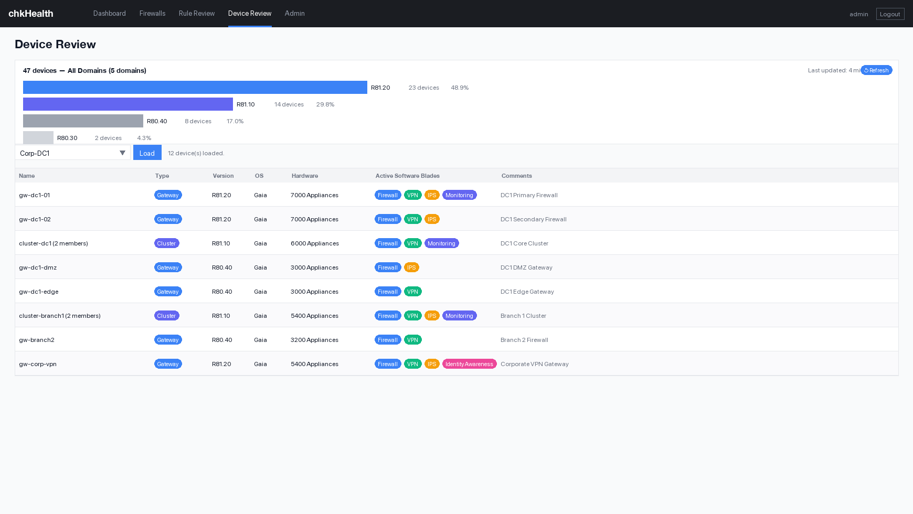

<picture>
  <source media="(prefers-color-scheme: dark)" srcset="logo-dark.svg">
  
</picture>

# chkHealth — Check Point Operations Dashboard

A read-only web dashboard for **Check Point Provider-1 (MDS)** environments.

## Features

- **Dashboard** — managed gateway counts, 30-day trend charts, infrastructure health (MDS HA pair + log servers)
- **Firewalls** — browse gateways and clusters by domain with full details
- **Rule Review** — view access rulebases, look up objects, interfaces, and NAT rules by domain
- **Device Review** — cross-domain gateway/cluster version distribution with per-domain device details and software blade status
- **Admin** — local user management, group-based access control, application logs

## Screenshots

### Dashboard
Summary counts, 30-day trend charts, and live infrastructure health for MDS servers and log servers.



### Firewalls
Browse all gateways and clusters by domain with version, management IP, SIC status, and comments.



### Rule Review
Load and search access rulebases by domain and policy package.



### Device Review
Cross-domain version distribution and per-domain device details with active software blades.



## Requirements

- Python ≥ 3.11
- [UV](https://docs.astral.sh/uv/) package manager
- A Check Point Provider-1 (MDS) environment with a read-only API key

---

## Deployment

### macOS (local development)

```bash
# Install UV if not already installed
curl -LsSf https://astral.sh/uv/install.sh | sh

git clone https://github.com/gatecrest-labs/chkHealth.git
cd chkHealth
uv sync

cp .env.example .env
# Edit .env — set SECRET_KEY, CP_MDS_PRIMARY, CP_API_KEY, etc.
# Generate a SECRET_KEY: python manage_users.py secret

python manage_users.py add admin --role admin
uv run flask --app app run --debug
```

Open http://127.0.0.1:5000

#### HTTPS with a self-signed cert (Mac only — quick local testing)

If you need HTTPS to test across your network or want secure cookies enabled, generate a self-signed cert:

```bash
bash scripts/gen-cert.sh
```

The script detects your Mac's LAN IP and bakes it into the cert's SAN so browsers don't flag an address mismatch. Then run with:

```bash
uv run flask run --host=0.0.0.0 --port=5000 --cert=certs/cert.pem --key=certs/key.pem
```

Also set `COOKIE_SECURE=true` in your `.env`.

To avoid the browser security warning on your own machine, trust the cert in your Mac Keychain (one-time):

```bash
sudo security add-trusted-cert -d -r trustRoot -k /Library/Keychains/System.keychain certs/cert.pem
```

Other devices on the network will see an untrusted-cert warning the first time — click through once to proceed. The cert is valid for 397 days; re-run `gen-cert.sh` to rotate it.

> **Note:** `certs/` is gitignored. For Linux, containers, or production, terminate TLS at a reverse proxy (nginx, Caddy) rather than in Flask/gunicorn.

### Red Hat Enterprise Linux / Rocky Linux / AlmaLinux

```bash
# Install Python 3.11+ (RHEL 9 ships with 3.11; RHEL 8 needs the module stream)
# RHEL 9:
sudo dnf install -y python3.11 python3.11-pip

# Install UV
curl -LsSf https://astral.sh/uv/install.sh | sh
source ~/.bashrc   # or open a new shell

# Clone and set up the project
git clone https://github.com/gatecrest-labs/chkHealth.git
cd chkHealth
uv sync --extra prod

cp .env.example .env
# Edit .env — fill in all CP_* values and SECRET_KEY

python manage_users.py add admin --role admin

# Run under gunicorn for production use
uv run gunicorn --workers 2 --bind 0.0.0.0:8080 wsgi:application
```

To run as a systemd service, create `/etc/systemd/system/chkhealth.service`:

```ini
[Unit]
Description=chkHealth web application
After=network.target

[Service]
Type=simple
User=appuser
WorkingDirectory=/opt/chkhealth
EnvironmentFile=/opt/chkhealth/.env
ExecStart=/opt/chkhealth/.venv/bin/gunicorn --workers 2 --bind 127.0.0.1:8080 wsgi:application
Restart=on-failure

[Install]
WantedBy=multi-user.target
```

```bash
sudo systemctl daemon-reload
sudo systemctl enable --now chkhealth
```

### Container (Docker / Podman)

Create a `Dockerfile` at the project root:

```dockerfile
FROM python:3.12-slim

WORKDIR /app
COPY pyproject.toml .
RUN pip install uv && uv sync --no-dev --extra prod

COPY app/ app/
COPY wsgi.py manage_users.py ./

# Runtime data lives in a mounted volume — not baked into the image
VOLUME ["/app/data"]
ENV USERS_FILE=/app/data/users.json
ENV GROUPS_FILE=/app/data/groups.json
ENV APP_SETTINGS_FILE=/app/data/app_settings.json
ENV METRICS_DB_PATH=/app/data/metrics.db

EXPOSE 8080
CMD ["uv", "run", "gunicorn", "--workers", "2", "--bind", "0.0.0.0:8080", "wsgi:application"]
```

```bash
# Build
docker build -t chkhealth .

# Run (pass .env file; mount a data volume for persistent users/groups)
docker run -d \
  --name chkhealth \
  --env-file .env \
  -v chkhealth-data:/app/data \
  -p 8080:8080 \
  chkhealth
```

> **Note:** The container image never contains `.env`, `users.json`, `groups.json`, or any credentials. Always pass secrets via `--env-file` or orchestrator secrets (Kubernetes Secrets, Podman secrets, etc.).

---

## Configuration

See `.env.example` for all available configuration options.

## Contributing

See [CONTRIBUTING.md](CONTRIBUTING.md).

## Security

See [SECURITY.md](SECURITY.md) for how to report vulnerabilities.

## License

[MIT](LICENSE)
